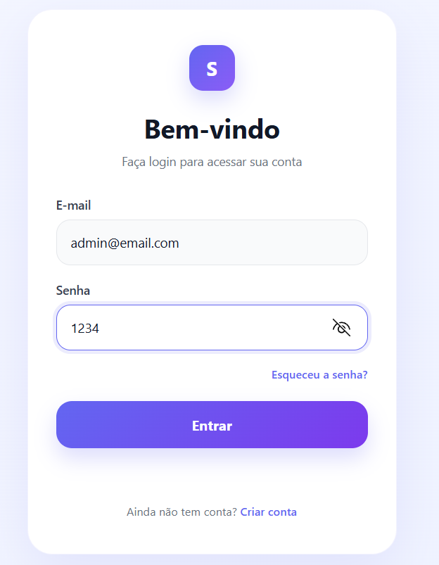

# 🔐 Login Clean UI

Uma tela de login moderna, clean e funcional desenvolvida com HTML, CSS e JavaScript.

## 📌 Sobre o projeto

Este projeto consiste em uma interface de login inspirada em padrões modernos de UI/UX (estilo Figma), com foco em:

- Design minimalista
- Experiência do usuário (UX)
- Interatividade com JavaScript
- Estrutura pronta para integração com backend

---

## 🚀 Funcionalidades

- ✅ Interface de login moderna
- ✅ Validação de campos
- ✅ Feedback de erro/sucesso
- ✅ Redirecionamento de página após login
- ✅ Botão com animação e efeito hover
- ✅ Layout responsivo básico

---

## 🛠️ Tecnologias utilizadas

- HTML5
- CSS3 (Flexbox + Gradiente + Animações)
- JavaScript (DOM + Eventos)

---

## 📂 Estrutura do projeto
login-clean/
│
├── index.html # Tela de login
├── home.html # Tela após login
└── README.md

---

## ▶️ Como executar

1. Baixe ou clone o repositório:
git clone https://github.com/sarathais-tech/login-clean.git

2. Abra a pasta no VSCode

3. Execute o arquivo:
index.html

---

## 🔑 Credenciais para teste
Email: admin@email.com

Senha: 1234

---

## 🧠 Conceitos aplicados

- Manipulação do DOM
- Eventos de clique
- Validação de formulário
- Redirecionamento com JavaScript
- Boas práticas de UI/UX

---

## 💡 Possíveis melhorias

- 🔐 Integração com backend (API / Java / Node)
- 📱 Responsividade completa
- 🎨 Integração com design real do Figma
- 🔒 Autenticação segura (JWT, banco de dados)
- 🌙 Dark mode

---

## 📸 Preview

**

---

## 👩‍💻 Autor

Desenvolvido por **Sara** 🚀  
Estudante de Engenharia de Software

---

## ⭐ Observação

Este projeto faz parte do desenvolvimento de portfólio com foco em projetos modernos e boas práticas de mercado.
